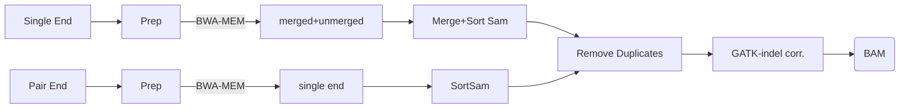
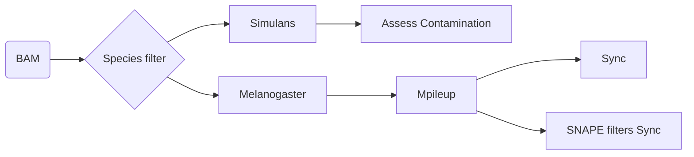

# DEST: Drosophila Evolution over Space and Time
## Version 2 (2023)
  > Scripts and tools for mapping and quality control of DEST dataset

## Citations (public releases)

#### Version 2: 

#### Version 1: [https://doi.org/10.1093/molbev/msab259](https://doi.org/10.1093/molbev/msab259)

## General Pipeline, Map to Hologenome w/ BWA-MEM

### Species Specific Pipeline

## Changes in Version 2.0 (Spring 2023)
* The DEST docker pipeline can now map both single-end and pair-end reads. Previously, only paired-end reads were available
* New naming convention: samples in version 2 have new names. These names are now in the form: "CH_Fri_Ors_1_2020-08-23". These fields represent **"Country Code" _ "region code" _ "city code" _ "replicate code" _ "year" _ "month" _ "date"**. This replaces the old nomenclature. A conversion table is now available in the metadata file. 

## Metadata
  > `populationInfo\`: Has supplemental data from the DrosEU, DrosRTEC, and DPGP files to make a unified meta-datafile. This datafile is
  supplemental table 1 of Kapun et al 2021. The meta-data file includes collection information, library quality filtering, inversion frequencies,
  weather stations and WorldClim environmental data.

## PoolSeq mapping pipeline
  > `mappingPipeline\`: Contains dockerized mapping pipeline. Downloads data, produces bam files, filter files, gSYNC files

## Incorporate Drosophila Genome Nexus data
  > `add_DGN_datda\`: Downloads, formats, lifts-over the Drosophila Genome Nexus data into gSYNC format

## SNP calling
  > `snpCalling\`: SNP calling based on gSYNC files. Runs PoolSNP and SNAPE using snakemake pipeline

## Example Scripts
  > `examples`: Provides a basic script to pull allele frequencies from a GDS table and also calculates the effective coverage

